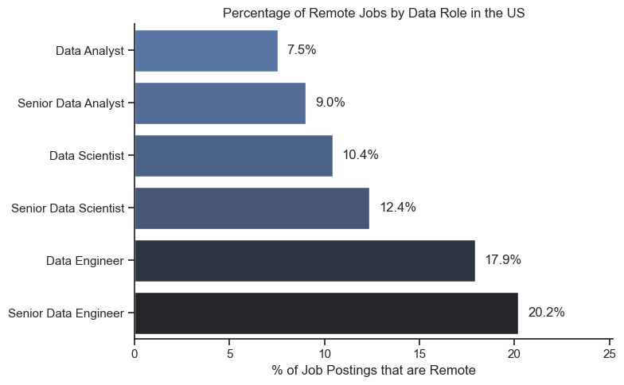
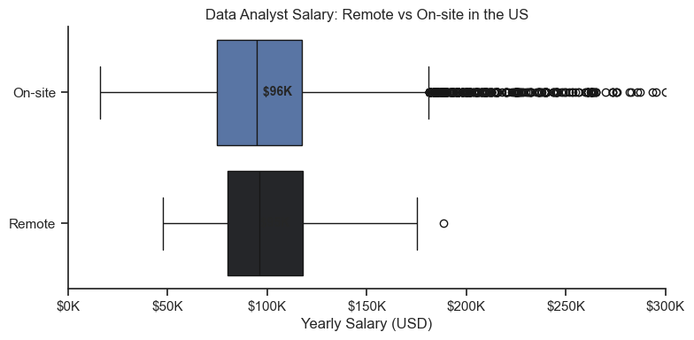
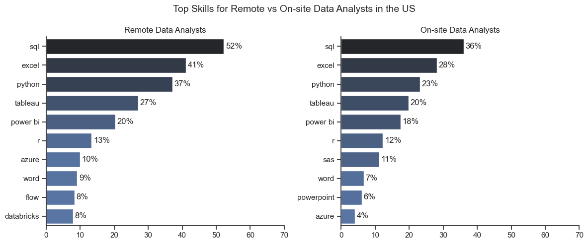

# US Data Job Market Analysis

This project was born from my journey to becoming a Data Analyst — I wanted to put my skills into practice while gaining a deeper understanding of the job market and the skills required not just for Data Analysts, but across the data ecosystem as a whole.

## Dataset

This analysis uses a dataset of **512,000+ job postings** for data-related roles in the United States (2025), sourced from the [data_jobs](https://huggingface.co/datasets/lukebarousse/data_jobs) dataset. It includes job titles, salaries, locations, required skills, and company information.

## Questions Explored

1. What are the most demanded skills for the top 3 data roles?
2. How are in-demand skills trending for Data Analysts throughout 2025?
3. How well do jobs and skills pay for Data Analysts?
4. How do remote vs on-site positions compare in salary and skills?
5. What are the most optimal skills to learn? (High Demand + High Paying)

## Tools & Technologies

- **Python** - Core language for all analysis
- **pandas** - Data manipulation and aggregation
- **matplotlib & seaborn** - Data visualization
- **Jupyter Notebooks** - Interactive analysis environment
- **CSV dataset** - Local data loading

## Project Structure

```
.
├── Project/
│   ├── 0_EDA_Intro.ipynb           # Exploratory data analysis
│   ├── 1_Skill_Demand.ipynb        # Top skills per role
│   ├── 2_Skills_Trend.ipynb        # Monthly skill trends
│   ├── 3_Salary_Analysis.ipynb     # Salary distributions
│   ├── 4_Remote_Analysis.ipynb     # Remote vs on-site comparison
│   ├── 5_Optimal_Skills.ipynb      # High-demand & high-paying skills
│   └── images/                     # Generated visualizations
├── pyproject.toml
└── README.md
```

## Analysis & Findings

### Exploratory Data Analysis

Before diving into the specific questions, I explored the full dataset to understand its shape and scope: job distribution by title, country, and company, as well as benefits like remote work, degree requirements, and health insurance. This helped define the focus of the analysis on the **US market** and the **top 3 data roles**.

**Notebook:** [0_EDA_Intro.ipynb](Project/0_EDA_Intro.ipynb)

---

### 1. Most Demanded Skills by Role

I identified the top 5 skills for Data Analysts, Data Engineers, and Data Scientists by calculating the percentage of job postings that mention each skill.

**Notebook:** [1_Skill_Demand.ipynb](Project/1_Skill_Demand.ipynb)


**Key findings:**
- **SQL** dominates for Data Analysts (36%) while **Python** leads for Data Scientists (49%) and Data Engineers (63%)
- Data Engineers require more cloud/infrastructure skills (AWS, Azure, Spark) vs. the analysis tools expected from Analysts (Excel, Tableau)
- Python and SQL are highly valued across all three roles

---

### 2. Skill Trends Over 2025

I tracked how the top 5 Data Analyst skills fluctuated month by month throughout 2025, using percentage of total job postings per month.

**Notebook:** [2_Skills_Trend.ipynb](Project/2_Skills_Trend.ipynb)


**Key findings:**
- SQL remained the most demanded skill throughout 2025
- Excel consistently ranked as the second most in-demand skill
- Python, Tableau, and SAS rounded out the top 5 with relatively stable demand across months

---

### 3. Salary Analysis

I examined salary distributions across the top 6 data roles using box plots, then drilled into Data Analyst salaries by skill.

**Notebook:** [3_Salary_Analysis.ipynb](Project/3_Salary_Analysis.ipynb)


**Key findings:**
- Senior Data Scientists and Senior Data Engineers have the highest salary potential, with significant outliers
- Specialized skills (MXNet, Kotlin, FastAPI) command median salaries up to ~$205K but appear in very few postings
- Foundational skills (Excel, SQL, PowerPoint) are the most in-demand but offer lower median salaries (~$78K-$101K)

---

### 4. Remote vs On-site Comparison

I compared remote and on-site positions across data roles to see how they differ in availability, salary, and the skills they demand.

**Notebook:** [4_Remote_Analysis.ipynb](Project/4_Remote_Analysis.ipynb)







**Key findings:**
- Engineering roles have the most remote opportunities: Data Engineers (3.5%) and Senior Data Engineers (3.3%), while Data Analysts have the least (1.1%)
- Remote Data Analysts earn a slightly higher median salary ($96K) compared to on-site ($95K)
- Remote roles demand higher proficiency in technical skills overall — SQL jumps from 36% (on-site) to 52% (remote), and Python from 23% to 37%

---

### 5. Optimal Skills (High Demand + High Pay)

I created a scatter plot mapping skill demand percentage against median salary, then categorized skills by technology type.

**Notebook:** [5_Optimal_Skills.ipynb](Project/5_Optimal_Skills.ipynb)


**Key findings:**
- **Programming skills** (Python, R) cluster at higher salary levels compared to other categories
- **Database skills** (Oracle, SQL Server) are associated with some of the highest salaries among all tool types
- **Analyst tools** (Tableau, Power BI) offer a good balance of demand and competitive pay
- SQL and Excel have the highest demand but are not the highest paying individually

## What I Learned

- What I mainly learned was to improve my step-by-step thinking process for manipulating and improving the quality of tables and DataFrames.
- What caught my attention the most was that in practically every job, **SQL** and **Python** always stand out.
- I improved a lot in creating visualizations, mainly with the `for/in` loop method.
- The languages that everyone in this field must absolutely know are **SQL** and **Python** — they are the foundation for working with data.

## Setup

```bash
# Clone the repository
git clone https://github.com/eliasfigueroa22/PYTHON_DATA_COURSE.git

# Install dependencies (requires uv)
uv sync

# Open notebooks
jupyter notebook Project/
```

Requires Python 3.14+.
